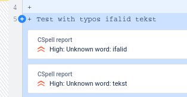
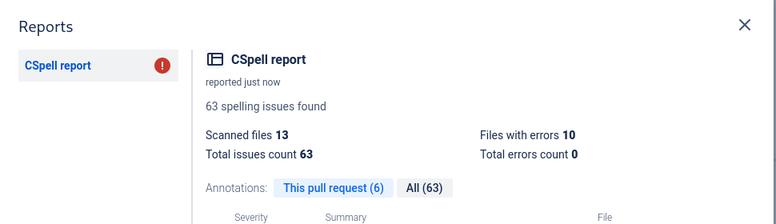

# Code insights integration for CSpell

Unofficial package fro report generation for CSpell>





## Usage

In your CI scripts that verify code using CSpell, add flag

```sh
 --reporter @ziemniakoss/cspell-bitbucket-code-insights-reporter
```

Resulting command could look like this

```sh
npx cspell . --reporter @ziemniakoss/cspell-bitbucket-code-insights-reporter
```

## Requirements

This reporter needs `curl` to be installed and in `PATH`.
This is required because Code Insights API can skip authorization in CI but only if using HTTP proxy requests, which are currently not supported by native JS API.
